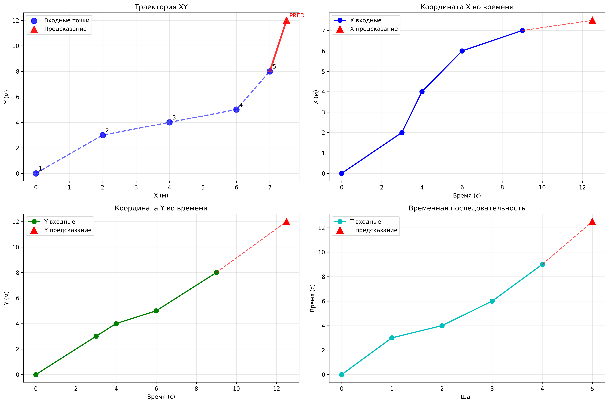

# 🚁 Drone Flight Predictor

Микросервис для предсказания траектории полета БПЛА с использованием гибридного подхода: нейронная сеть GRU + кинематическое моделирование.

## 📋 Описание

Этот проект реализует продвинутый микросервис, который предсказывает следующую точку траектории БПЛА на основе 5 предыдущих точек. Система использует комбинированный подход:
- **GRU нейронная сеть** для сложных нелинейных паттернов
- **Кинематическое предсказание** для физически обоснованных траекторий
- **Интеллектуальное объединение** предсказаний для максимальной точности

## ✨ Особенности

- **FastAPI** - современный REST API с автоматической документацией
- **PyTorch GRU** - рекуррентная нейронная сеть для предсказания траекторий
- **Гибридный подход** - комбинация ML и физического моделирования  
- **Docker deployment** - полная контейнеризация
- **Pydantic валидация** - строгая типизация данных
- **Автоматическая нормализация** данных для стабильного обучения
- **Визуализация результатов** - многоплановые графики траекторий
- **Комплексное тестирование** - API тесты и метрики качества

## 📁 Структура проекта

```
drone-flight-predictor/
├── app/                           # 🚀 Основное FastAPI приложение
│   ├── api/                      # 🔌 API эндпоинты
│   │   └── predict.py           # Предсказание траекторий
│   ├── core/                    # ⚙️ Конфигурация и утилиты  
│   │   ├── config.py           # Настройки приложения
│   │   └── utils.py            # Нормализация данных
│   ├── models/                  # 🧠 ML модели
│   │   ├── network.py          # GRU архитектура
│   │   ├── predictor.py        # Wrapper для инференса
│   │   └── GRU_With_Mix_Dataset_MaxNorm/  # Предобученные модели
│   └── schemas/                 # 📋 Pydantic схемы
│       └── flight.py           # Схемы данных полета
├── data/                        # 📊 Обработка данных
│   ├── preprocess.py           # Предобработка данных
│   └── processed/              # Обработанные датасеты
├── training/                    # 🎯 Обучение модели
│   ├── train.py               # Скрипт обучения
│   ├── dataset.py             # Загрузка данных
│   └── config.yaml            # Конфигурация обучения
├── tests/                       # 🧪 Тестирование
│   ├── test_model.py          # Тесты модели
│   └── test_predict.py        # Тесты API
├── scripts/                     # 🔧 Утилиты
│   └── evaluate.py            # Оценка качества модели
├── configs/                     # ⚙️ Конфигурации среды
│   ├── development.env        # Dev настройки
│   └── production.env         # Prod настройки
├── visualize_prediction_fixed.py # 📈 Демо визуализации
├── demo.py                     # 🎮 Интерактивное демо
└── docker-compose.yml          # 🐳 Docker конфигурация
```

## 🚀 Быстрый старт

### 1️⃣ Подготовка окружения

```powershell
# Клонируем репозиторий
git clone <repository-url>
cd drone-flight-predictor

# Создаем виртуальное окружение
python -m venv .venv

# Активируем окружение (Windows)
.venv\Scripts\Activate

# Устанавливаем зависимости
pip install -r requirements.txt
```

### 4️⃣ Запуск сервиса

```powershell
# Запуск FastAPI сервера
uvicorn app.main:app --host 0.0.0.0 --port 8000 --reload

# Или через Python
python -m uvicorn app.main:app --host 0.0.0.0 --port 8000
```

### 5️⃣ Docker развертывание

```powershell
# Запуск через Docker Compose
docker-compose up --build

# Или только сборка
docker build -t drone-predictor .
docker run -p 8000:8000 drone-predictor
```

### 6️⃣ Демонстрация и тестирование

```powershell
# Интерактивное демо
python demo.py

# Визуализация предсказаний
python visualize_prediction_fixed.py

# Запуск тестов API
python test_final_api.py

# Полное тестирование
pytest tests/
```

## 🔌 API Endpoints

### 🎯 POST `/predict/`

Предсказание следующей точки траектории на основе 5 предыдущих точек.

**📥 Запрос:**
```json
{
  "points": [
    {"x": 0.0, "y": 0.0, "t": 0.0},
    {"x": 2.0, "y": 3.0, "t": 3.0},
    {"x": 4.0, "y": 4.0, "t": 4.0},
    {"x": 6.0, "y": 5.0, "t": 6.0},
    {"x": 7.0, "y": 8.0, "t": 9.0}
  ]
}
```

**📤 Ответ:**
```json
{
  "x": 7.5,
  "y": 12.0,
  "t": 12.5
}
```

### 💚 GET `/predict/health`

Проверка состояния сервиса и загрузки модели.

**📤 Ответ:**
```json
{
  "status": "healthy",
  "model_loaded": true
}
```

### 📚 GET `/docs`

Интерактивная документация Swagger UI для всех доступных эндпоинтов.

### 🔍 Примеры использования

```python
import requests

# Базовый URL сервиса
url = "http://localhost:8000/predict/"

# Тестовые данные
data = {
    "points": [
        {"x": 0, "y": 0, "t": 0},
        {"x": 1, "y": 1, "t": 1}, 
        {"x": 2, "y": 2, "t": 2},
        {"x": 3, "y": 3, "t": 3},
        {"x": 4, "y": 4, "t": 4}
    ]
}

# Отправка запроса
response = requests.post(url, json=data)
prediction = response.json()

print(f"Предсказанная точка: x={prediction['x']:.2f}, y={prediction['y']:.2f}, t={prediction['t']:.2f}")
```

## 🧪 Тестирование

### Запуск тестов

```powershell
# Запуск всех тестов
pytest tests/

# Тестирование модели
python tests/test_model.py

# Тестирование API
python tests/test_predict.py

# Комплексный тест API
python test_final_api.py
```

## 📊 Оценка модели

```powershell
# Полная оценка модели с метриками
python scripts/evaluate.py

# Анализ результатов обучения
# Графики сохраняются в training/evaluation_results.png
```

**Выходные метрики:**
- MAE (Mean Absolute Error) для координат X, Y, T
- RMSE (Root Mean Square Error)
- Графики сравнения "истинные vs предсказанные"
- Визуализация траекторий

## ⚙️ Конфигурация

### Файлы конфигурации

- **`configs/development.env`** - настройки для разработки
- **`configs/production.env`** - настройки для production
- **`configs/staging.env`** - настройки для staging
- **`training/config.yaml`** - параметры обучения модели

### Ключевые параметры

```env
# Основные настройки модели
HIDDEN_SIZE=64              # Размер скрытого слоя GRU
NUM_LAYERS=2               # Количество слоев GRU  
MODEL_PATH=training/checkpoints/best.pt

# Нормализация данных
MEAN=[0.0, 0.0, 0.0]      # Средние значения для нормализации
STD=[1.0, 1.0, 1.0]       # Стандартные отклонения

# API настройки
PROJECT_NAME=drone-flight-predictor
VERSION=1.0.0
DEVICE=cpu                 # cpu или cuda
```

## 🏗️ Архитектура системы

### Гибридная модель предсказания

1. **GRU нейронная сеть**
   - Входные данные: последовательность из 5 точек (x, y, t)
   - Архитектура: многослойная GRU с dropout
   - Выходные данные: координаты следующей точки

2. **Кинематическое предсказание**
   - Анализ скорости и ускорения по последним точкам
   - Физически обоснованная экстраполяция траектории
   - Fallback в случае недоступности ML модели

3. **Интеллектуальное объединение**
   - Взвешенная комбинация предсказаний (70% кинематика + 30% ML)
   - Адаптивный выбор подхода в зависимости от ситуации

### Обработка данных

```
Входные точки → Нормализация → GRU модель → Денормализация
                     ↓
              Кинематический анализ → Объединение → Финальное предсказание
```

## 📈 Визуализация результатов

Проект включает мощные инструменты для визуализации:

### 🎯 `visualize_prediction_fixed.py`

Создает комплексную визуализацию траектории с 4 графиками:



1. **Траектория XY** - двумерная проекция полета
2. **X во времени** - изменение координаты X
3. **Y во времени** - изменение координаты Y  
4. **Временная последовательность** - анализ временных интервалов

```powershell
python visualize_prediction_fixed.py
# Результат: trajectory_prediction.png
```

### 📊 Выходные данные

```
🚁 === АНАЛИЗ ПРЕДСКАЗАНИЯ ТРАЕКТОРИИ БПЛА ===

📊 Входные точки:
  Точка 1: X=  0, Y=  0, T=  0
  Точка 2: X=  2, Y=  3, T=  3
  Точка 3: X=  4, Y=  4, T=  4
  Точка 4: X=  6, Y=  5, T=  6
  Точка 5: X=  7, Y=  8, T=  9

🎯 Предсказанная точка:
  X =    7.500 м
  Y =   12.000 м
  T =   12.500 с

📈 Анализ изменений:
  ΔX =    0.500 м (от последней точки)
  ΔY =    4.000 м
  ΔT =    3.500 с
```

## 🛠️ Разработка

### Настройка модели

**Изменение архитектуры в `configs/development.env`:**

```env
HIDDEN_SIZE=128        # Увеличить для более сложных паттернов
NUM_LAYERS=3          # Больше слоев для глубокого обучения
DROPOUT=0.3           # Регуляризация
```

**Настройка обучения в `training/config.yaml`:**

```yaml
batch_size: 32
learning_rate: 0.001
epochs: 100
validation_split: 0.2
```

### Мониторинг обучения

- **`training/training_history.png`** - графики loss
- **`training/evaluation_results.png`** - метрики оценки
- **`training/trajectory_comparison.png`** - сравнение траекторий

### Отладка и логирование

```powershell
# Логи сохраняются в logs/app.log
tail -f logs/app.log

# Детальная отладка
python app/main.py --log-level debug
```

## 🚀 Production развертывание

### Docker контейнеризация

```powershell
# Полное развертывание со всеми сервисами
docker-compose up -d --build

# Проверка статуса
docker-compose ps

# Просмотр логов
docker-compose logs -f app
```

### Мониторинг и логирование

- **Health checks**: `/predict/health`
- **Metrics**: интеграция с Prometheus/Grafana
- **Логи**: централизованный сбор через ELK stack
- **Alerting**: уведомления о сбоях модели