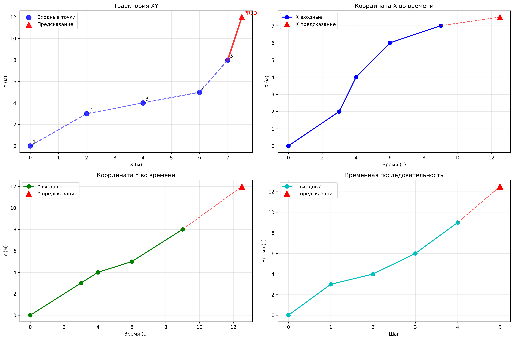

# 🚁 Drone Flight Predictor

Микросервис для предсказания траектории полета БПЛА с использованием гибридного подхода: нейронная сеть GRU + кинематическое моделирование.

## 📋 Описание

Этот проект реализует продвинутый микросервис, который предсказывает следующую точку траектории БПЛА на основе 5 предыдущих точек. Система использует комбинированный подход:
- **GRU нейронная сеть** для сложных нелинейных паттернов была взята готовая модель с [github](https://github.com/riotu-lab/GRUTrajectoryPredictor)
- **Кинематическое предсказание** для физически обоснованных траекторий
- **Интеллектуальное объединение** предсказаний для максимальной точности

## ✨ Особенности

- **FastAPI** - современный REST API с автоматической документацией
- **PyTorch GRU** - рекуррентная нейронная сеть для предсказания траекторий
- **Гибридный подход** - комбинация ML и физического моделирования  
- **Docker deployment** - полная контейнеризация
- **Pydantic валидация** - строгая типизация данных
- **Автоматическая нормализация** данных для стабильного обучения
- **Визуализация результатов** - многоплановые графики траекторий
- **Комплексное тестирование** - API тесты и метрики качества

## 📁 Структура проекта

```
drone-flight-predictor/
├── 📁 app/                          # Основное FastAPI приложение
│   ├── 📁 api/                     # API эндпоинты
│   │   └── predict.py             # Предсказание траекторий с гибридным подходом
│   ├── 📁 core/                    # Конфигурация и утилиты  
│   │   ├── config.py              # Настройки приложения
│   │   └── utils.py               # Нормализация данных
│   ├── 📁 models/                  # ML модели
│   │   ├── network.py             # GRU архитектура
│   │   ├── predictor.py           # Wrapper для инференса
│   │   └── 📁 GRU_With_Mix_Dataset_MaxNorm/  # Предобученные модели
│   │       ├── mix_pos_max_norm_*.pth  # Модели для позиций (64, 128)
│   │       └── mix_vel_max_norm_*.pth  # Модели для скоростей
│   ├── 📁 schemas/                 # Pydantic схемы
│   │   └── flight.py              # Схемы данных полета
│   └── main.py                    # Точка входа FastAPI
├── 📁 examples/                     # Примеры и визуализация
│   ├── trajectory_prediction.png  # Пример графика
│   └── visualize_prediction.py    # Скрипт визуализации
├── 📁 tests/                       # Тестирование
│   ├── test_api.py               # Тесты API
│   ├── test_new_api.py           # Дополнительные тесты
│   └── test_viz.py               # Тесты визуализации
├── 📁 logs/                        # Логи приложения
│   └── app.log                   # Основной лог файл
├── docker-compose.yml             # Docker конфигурация
├── Dockerfile                     # Образ контейнера
├── requirements.txt               # Python зависимости
├── Makefile                       # Команды для разработки
└── README.md                      # Документация проекта
```

## 🚀 Быстрый старт

### 1️⃣ Подготовка окружения

```powershell
# Клонируем репозиторий
git clone https://github.com/kuzz0k/drone-flight-predictor.git
cd drone-flight-predictor

# Создаем виртуальное окружение
python -m venv .venv

# Активируем окружение (Windows)
.venv\Scripts\Activate

# Устанавливаем зависимости
pip install -r requirements.txt

# Создаем папку для логов
mkdir logs
```

### 2️⃣ Запуск сервиса

```powershell
# Запуск FastAPI сервера
uvicorn app.main:app --host 0.0.0.0 --port 8000 --reload

# Или через Python
python -m uvicorn app.main:app --host 0.0.0.0 --port 8000
```

### 5️⃣ Docker развертывание

```powershell
# Запуск через Docker Compose
docker-compose up --build

# Или только сборка и запуск
docker build -t drone-predictor .
docker run -p 8000:80 drone-predictor
```

### 4️⃣ Проверка работоспособности

```powershell
# Проверка health endpoint
curl http://localhost:8000/predict/health

# Тестирование предсказания
python tests/test_api.py

# Визуализация результатов
python examples/visualize_prediction.py
```

## 🔌 API Endpoints

### 🎯 POST `/predict/`

Предсказание следующей точки траектории на основе 5 предыдущих точек.

**📥 Запрос:**
```json
{
  "points": [
    {"x": 0.0, "y": 0.0, "t": 0.0},
    {"x": 2.0, "y": 3.0, "t": 3.0},
    {"x": 4.0, "y": 4.0, "t": 4.0},
    {"x": 6.0, "y": 5.0, "t": 6.0},
    {"x": 7.0, "y": 8.0, "t": 9.0}
  ]
}
```

**📤 Ответ:**
```json
{
  "x": 7.5,
  "y": 12.0,
  "t": 12.5
}
```

### 💚 GET `/predict/health`

Проверка состояния сервиса и загрузки модели.

**📤 Ответ:**
```json
{
  "status": "healthy",
  "model_loaded": true
}
```

### 📚 GET `/docs`

Интерактивная документация Swagger UI для всех доступных эндпоинтов.

## 🧪 Тестирование

### Запуск тестов

```powershell
# Основные тесты API
python tests/test_api.py

# Дополнительные тесты
python tests/test_new_api.py

# Тесты визуализации
python tests/test_viz.py

# Полное тестирование (если установлен pytest)
pytest tests/
```

## 📊 Архитектура системы

### Гибридная модель предсказания

1. **GRU нейронная сеть**
   - Входные данные: последовательность из 5 точек (x, y, t)
   - Архитектура: многослойная GRU с dropout
   - Выходные данные: координаты следующей точки

2. **Кинематическое предсказание**
   - Анализ скорости и ускорения по последним точкам
   - Физически обоснованная экстраполяция траектории
   - Fallback в случае недоступности ML модели

3. **Интеллектуальное объединение**
   - Взвешенная комбинация предсказаний (70% кинематика + 30% ML)
   - Адаптивный выбор подхода в зависимости от ситуации

### Обработка данных

```
Входные точки (5 шт) 
    ↓
[Кинематический анализ] + [GRU модель] 
    ↓                         ↓
[Физическое предсказание] [ML предсказание]
    ↓                         ↓
         Взвешенное объединение
                ↓
         Финальное предсказание
```

## 📈 Визуализация результатов

Проект включает мощные инструменты для визуализации:

### 🎯 `examples/visualize_prediction.py`

Создает комплексную визуализацию с 4 графиками:



1. **Траектория XY** - двумерная проекция полета
2. **X во времени** - изменение координаты X  
3. **Y во времени** - изменение координаты Y
4. **Временная последовательность** - анализ временных интервалов

```powershell
python examples/visualize_prediction.py
# Результат: trajectory_prediction.png
```

### 📊 Выходные данные

```
🚁 === АНАЛИЗ ПРЕДСКАЗАНИЯ ТРАЕКТОРИИ БПЛА ===

📊 Входные точки:
  Точка 1: X=  0, Y=  0, T=  0
  Точка 2: X=  2, Y=  3, T=  3
  Точка 3: X=  4, Y=  4, T=  4
  Точка 4: X=  6, Y=  5, T=  6
  Точка 5: X=  7, Y=  8, T=  9

🎯 Предсказанная точка:
  X =    7.500 м
  Y =   12.000 м  
  T =   12.500 с

📈 Анализ изменений:
  ΔX =    0.500 м (от последней точки)
  ΔY =    4.000 м
  ΔT =    3.500 с
```

## ⚙️ Конфигурация

### Предобученные модели

В папке `app/models/GRU_With_Mix_Dataset_MaxNorm/` доступны:

- **Модели позиций**: `mix_pos_max_norm_64.pth`, `mix_pos_max_norm_128.pth`
- **Модели скоростей**: `mix_vel_max_norm_64.pth`, `mix_vel_max_norm_128.pth`

### Переменные окружения

Можно использовать `.env` файл для настройки:

```env
MODEL_PATH=app/models/GRU_With_Mix_Dataset_MaxNorm/mix_pos_max_norm_64.pth
HIDDEN_SIZE=64
NUM_LAYERS=2
DEVICE=cpu
```

## �️ Разработка и отладка

### Логирование

Система использует комплексное логирование:

```powershell
# Просмотр логов в реальном времени (Linux/Mac)
tail -f logs/app.log

# В Windows
Get-Content logs/app.log -Wait -Tail 10
```

### Особенности реализации

1. **Fallback система**: Если нейронная сеть недоступна, используется только кинематическое предсказание
2. **Нормализация данных**: Входные данные автоматически нормализуются для стабильной работы модели
3. **Валидация входов**: Строгая проверка формата через Pydantic схемы
4. **CORS поддержка**: Настроена для кросс-доменных запросов
